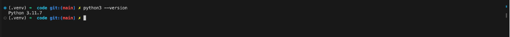
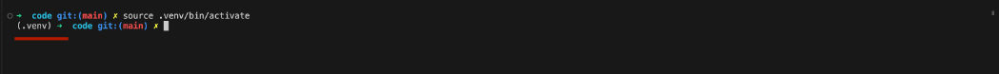
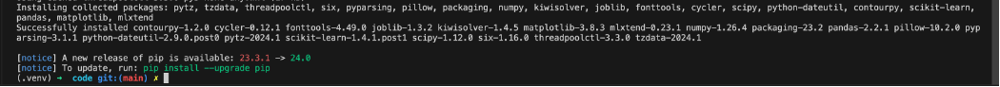
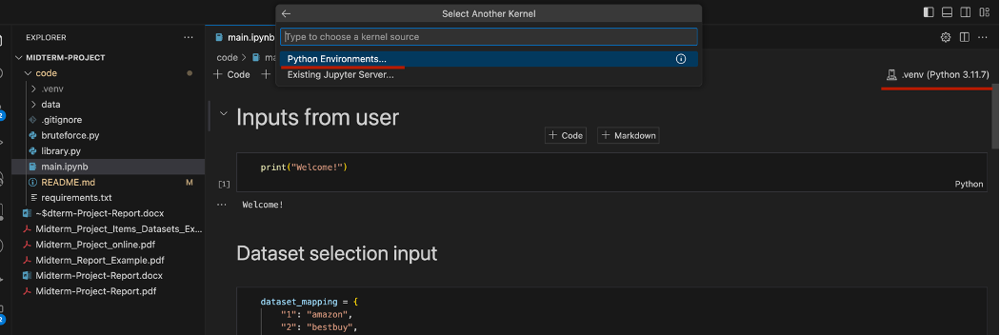
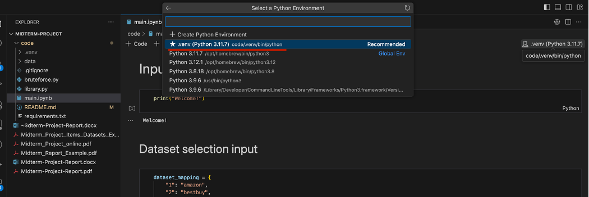
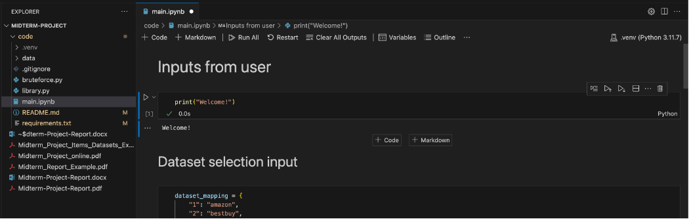

# Frequent pattern algorithm analysis

This repository implements brute force algorithm to find frequent patterns in transactions using min. support and min. confidence.

Summarizing with time analysis of 3 different frequent pattern algorithms

1. Brute force algorithm
2. Apriori algorithm
3. FP-Growth algorithm

## Local setup

### Python configuration

python==3.11.7

### Python package configuration

1. pandas
2. mlxtend
3. ipython
4. ipykernel

### Steps to setup project locally

1. Make sure that you have correct python version installed. It may not work, if python version is different.

2. Create a virtual environtment using `python3 -m venv .venv`

3. Activate the virtaul environment using `source .venv/bin/activate`

4. Install all the packages in **requirements.txt** using `pip install -r requirements.txt`

5. Select existing `.venv` python environment as the kernel for the `main.ipynb` Jupyter notebook.

6. Run cells in `main.ipynb` jupyter notebook

